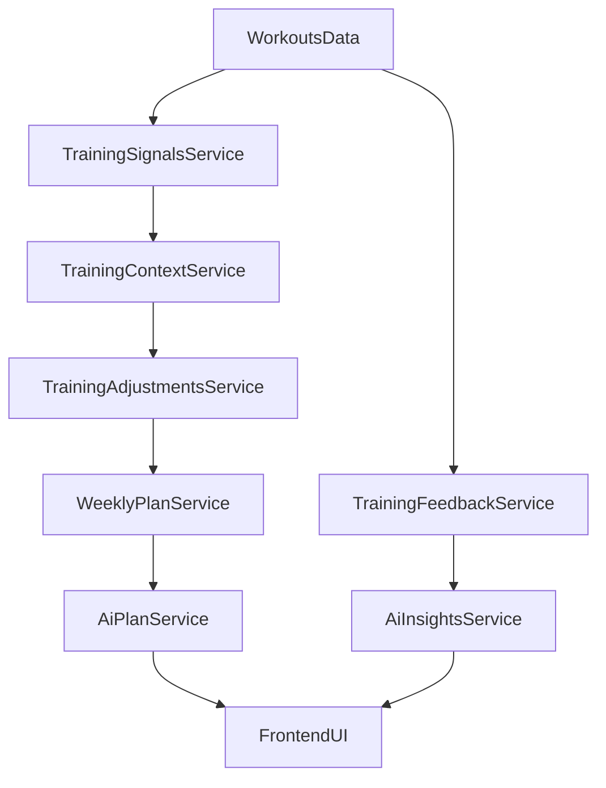

> HISTORYCZNE - nie uzywac jako aktualnej instrukcji.
> Aktywne dokumenty: `docs/status.md` (wykonane funkcjonalnosci), `docs/roadmap.md` (plan), `docs/deploy/frontend-iqhost-deploy.txt` (deploy frontu), `docs/integrations.md` (integracje).
# Raport stanu projektu (techniczny)

## 1) Drzewo projektu i role katalogów

```text
MarcinCoach-v2/
├─ src/                    # frontend React + TypeScript (Vite)
├─ backend/                # backend Node.js (NestJS + Prisma) - legacy, aktualnie główny dla UI
├─ backend-php/            # backend PHP (Laravel) - ścieżka migracyjna
├─ docs/                   # dokumentacja architektury i migracji
├─ public/                 # statyczne assety frontendu
└─ pliki konfiguracyjne    # toolchain frontend/backend
```

### Frontend (`src`)
- Kluczowe moduły:
  - `src/components` (m.in. `AiPlanSection`, `WeeklyPlanSection`, `AnalyticsSummary`, `WorkoutsList`),
  - `src/api` (klienci endpointów),
  - `src/types` i `src/utils`.
- Aktualny endpoint bazowy API: `http://localhost:3000` (`src/api/client.ts`) -> frontend jest aktualnie podpięty do backendu Node.

### Backend Node (`backend/src`)
- Moduły domenowe i API: `workouts`, `weekly-plan`, `training-signals`, `training-feedback`, `training-feedback-v2`, `training-adjustments`, `training-context`, `user-profile`, `auth`.
- Moduły AI: `ai-plan`, `ai-insights`, `ai-rate-limit`, `ai-cache`.
- Główne spinanie modułów: `backend/src/app.module.ts`.
- Warstwa danych: Prisma (`backend/prisma/schema.prisma`).

### Backend PHP (`backend-php`)
- API: `backend-php/routes/api.php`.
- Kontrolery: `backend-php/app/Http/Controllers/Api`.
- Serwisy domenowe (aktualnie głównie ingest + signals/compliance):  
  `TrainingSignalsService`, `TrainingSignalsV2Service`, `PlanComplianceService`, `PlanComplianceV2Service`.
- Komendy backfill: `backend-php/app/Console/Commands`.

### Testy i konfiguracje
- Node: testy w `backend/test` oraz `*.spec.ts` obok modułów.
- PHP: `backend-php/tests/Feature`, `backend-php/tests/Unit`.
- Frontend: brak rozbudowanego zestawu testów komponentowych w repo (do uzupełnienia).

---

## 2) Wdrożone funkcjonalności (E2E vs API-only)

## A. E2E (UI + API) - aktywna ścieżka Node

### Auth
- Status: `E2E`
- Backend: Node (`/auth/login`, `/auth/register`).
- Frontend: logowanie w `src/App.tsx`.

### Workouts (import/upload/lista/szczegóły/meta/delete)
- Status: `E2E`
- Backend: Node (`/workouts`, `/workouts/upload`, `/workouts/import`, `/workouts/:id`, `/workouts/:id/meta`, `/workouts/:id` DELETE).
- Frontend: `src/components/WorkoutsList.tsx`, API w `src/api/workouts.ts`.

### Analytics summary
- Status: `E2E`
- Backend: Node (`/workouts/analytics/summary-v2`).
- Frontend: `src/components/AnalyticsSummary.tsx`.

### Weekly plan
- Status: `E2E`
- Backend: Node (`/weekly-plan`).
- Frontend: `src/components/WeeklyPlanSection.tsx`.

### AI plan
- Status: `E2E`
- Backend: Node (`/ai/plan`).
- Frontend: `src/components/AiPlanSection.tsx`.

## B. API-only (Node)

### User profile
- Status: `API-only` (częściowo przygotowane FE API, brak pełnego spięcia UI flow)
- Backend: Node (`/me/profile` GET/PUT).
- Frontend: helpery w `src/api/profile.ts`.

### Training feedback / context / adjustments / insights
- Status: `API-only` lub częściowo używane
- Backend: Node:
  - `/training-feedback`,
  - `/training-context`,
  - `/training-adjustments`,
  - `/training-signals`,
  - `/ai/insights`,
  - `/training-feedback-v2/*`.
- Frontend: brak pełnego wykorzystania wszystkich endpointów w aktualnym UI.

## C. PHP/Laravel (migracja, API-only)

### Health + basic identity
- Status: `API-only`
- Endpointy: `/api/health`, `/api/me`.

### Workout ingest i per-workout metryki
- Status: `API-only`
- Endpointy:
  - `/api/workouts/import`,
  - `/api/workouts/{id}`,
  - `/api/workouts/{id}/signals`,
  - `/api/workouts/{id}/compliance`,
  - `/api/workouts/{id}/compliance-v2`.
- Uwagi: backend PHP generuje signals/compliance przy imporcie, ale frontend nie jest jeszcze przełączony na ten backend.

### Najważniejsza różnica Node vs PHP (aktualny stan)
- Node jest produkcyjnie „szerszy” funkcjonalnie dla UI (auth, AI plan, weekly plan, analytics, pełny CRUD workout/meta).
- PHP jest etapem migracyjnym z mocnym naciskiem na ingest + compliance/sygnały per workout.

---

## 3) Logika AI

## Moduły i odpowiedzialności (Node)
- `backend/src/ai-plan`:
  - endpoint `GET /ai/plan`,
  - składa odpowiedź AI planu na bazie kontekstu, adjustments i weekly plan.
- `backend/src/ai-insights`:
  - endpoint `GET /ai/insights`,
  - generuje ryzyka/pytania/summary na bazie feedbacku i profilu.
- `backend/src/training-feedback-v2`:
  - Q&A do pojedynczego treningu, endpointy pytanie/odpowiedź.
- `backend/src/ai-rate-limit`:
  - dzienne limity wywołań AI per użytkownik.
- `backend/src/ai-cache`:
  - cache in-memory per namespace/user/day/days-window.

## Przepływ danych (AI)



## Provider/model/rate-limit/cache/fallback
- Provider AI:
  - `AI_PLAN_PROVIDER` (`openai`/`stub`),
  - `AI_INSIGHTS_PROVIDER` (`openai`/`stub`).
- Domyślne modele:
  - Plan: `gpt-5` (`AI_PLAN_MODEL`),
  - Insights: `gpt-5-mini` (`AI_INSIGHTS_MODEL`),
  - Feedback Q&A: model z env dla modułu feedback-v2-ai.
- Rate-limit:
  - `AiDailyRateLimitService`: mapowanie `userId:YYYY-MM-DD(UTC)`, limity env dla dev/prod.
- Cache:
  - `AiCacheService`: namespace `plan|insights|feedback`, reset dzienny UTC.
- Fallback:
  - AI Plan: fallback do deterministic stub przy błędzie OpenAI.
  - AI Insights: `stub` albo `openai` wg provider; brak pełnego retry/fallback chain poza trybem provider.

## Status migracji AI do PHP
- W Laravel brak endpointów AI (`/ai/plan`, `/ai/insights`, feedback-v2-ai).
- Logika AI pozostaje aktualnie po stronie Node.

---

## 4) Ocena stanu i ryzyka

### Ryzyka techniczne
1. **Dual-backend divergence**  
   Frontend działa na Node, a PHP ma inny zakres i kontrakty endpointów; rośnie koszt synchronizacji zmian.
2. **Brak parity AI w PHP**  
   Migracja backendu bez migracji AI i warstw kontekstowych grozi regresją funkcjonalną.
3. **Różnice kontraktów API**  
   Node i PHP nie są drop-in kompatybilne dla obecnego klienta frontend.
4. **Rate-limit/cache in-memory**  
   Dobre na dev/single instance, ryzykowne przy skalowaniu horyzontalnym bez współdzielonego store.
5. **Test coverage asymmetry**  
   Brak spójnego E2E packa cross-stack (frontend + docelowe PHP API).

### Ryzyka produktowe
1. **Nierówna jakość experience po migracji**  
   Jeśli frontend przełączy się na PHP zbyt wcześnie, część user value (AI/feedback/adjustments) może zniknąć.
2. **Niewidoczne regresje decyzyjne**  
   Compliance/signals bez pełnego kontekstu mogą dawać inne rekomendacje niż w Node.

---

## 5) Rekomendowana sekwencja działań

## MVP (parity minimalne)
1. Dodać w PHP brakujące endpointy i kontrakty dla:
   - `PATCH /workouts/{id}/meta`,
   - `GET /training-feedback`,
   - `GET /training-signals` (okno użytkownika).
2. Zrobić adapter kontraktów FE (lub warstwę BFF), aby UI mógł przełączać backend bez refaktoru całego frontendu.
3. Ujednolicić podstawowe reguły compliance Node -> PHP.

## Etap 2
1. Migracja warstwy AI do PHP:
   - `ai-plan`,
   - `ai-insights`,
   - feedback-v2 AI Q&A.
2. Przeniesienie rate-limit/cache na współdzielone storage (np. Redis) dla produkcji.
3. Testy E2E porównawcze Node vs PHP na tych samych fixture danych.

## Decyzja architektoniczna do podjęcia
- Czy AI i logika coachingowa pozostają długoterminowo w Node jako dedykowany serwis, a PHP przejmuje tylko domenę treningową, czy pełna konsolidacja do Laravel.

---

## Podsumowanie wykonawcze
- **Stan obecny:** produkcyjny przepływ użytkownika i AI jest głównie po stronie Node.  
- **Stan PHP:** solidny fundament ingest + compliance/sygnały per workout, ale bez pełnej parity funkcjonalnej i bez logiki AI.  
- **Najbliższy cel:** domknięcie parity MVP (meta/feedback/signals) i dopiero potem kontrolowane przełączanie frontendu na PHP.
