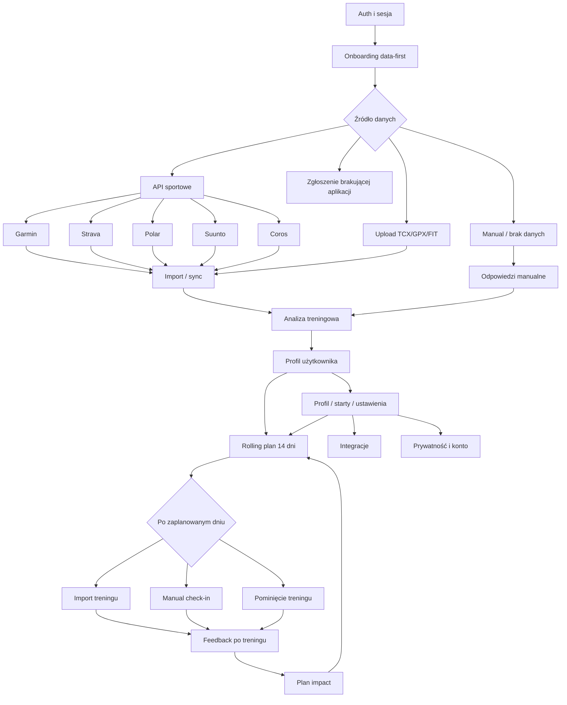
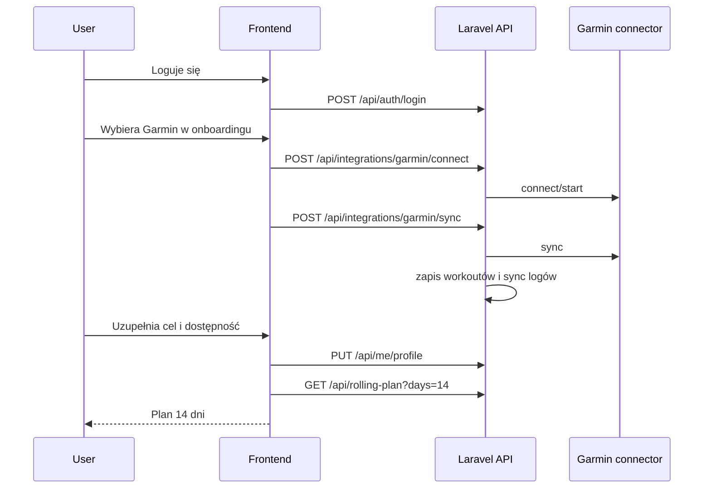
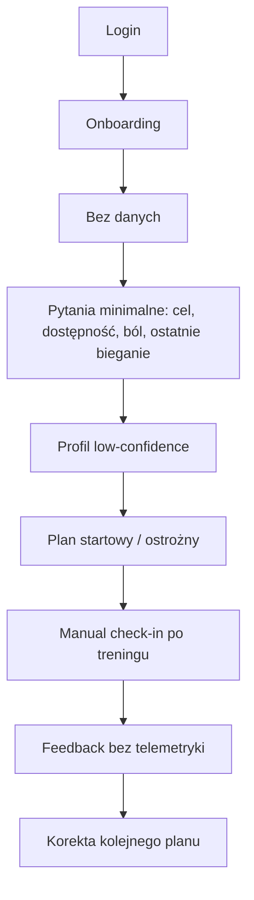
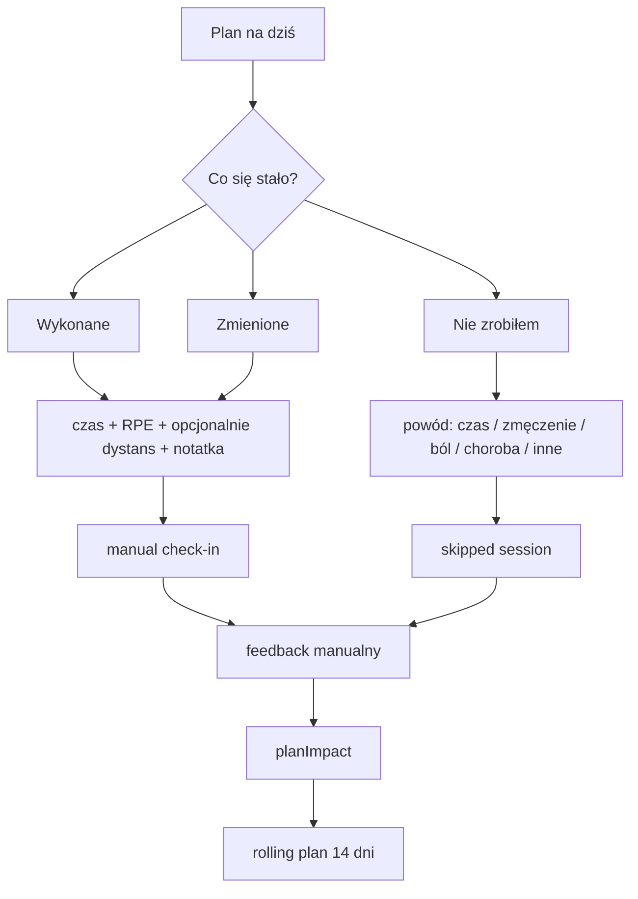

# MarcinCoach v2 - schemat funkcjonalny portalu

Stan: 2026-04-28.
Status dokumentu: odtworzony schemat funkcjonalny na podstawie aktywnych dokumentów i aktualnego kodu.

Ten dokument opisuje **co portal ma robić z perspektywy użytkownika i systemu**. Nie jest wireframe'em, nie jest listą zadań developerskich i nie zastępuje scenariuszy użytkownika. Ma być mapą, do której można wrócić przy decyzjach produktowych, konsultacji IT i planowaniu kolejnych pakietów MVP.

Źródła:
- `docs/status.md`
- `docs/roadmap.md`
- `docs/integrations.md`
- `docs/user-scenarios/README.md`
- `docs/user-scenarios/coverage-matrix.md`
- `docs/user-scenarios/gaps-and-next-steps.md`
- `docs/user-scenarios/it-consultation-scenarios.md`
- aktualny kod w `src/` i `backend-php/routes/api.php`

---

## 1. Definicja portalu

MarcinCoach v2 to webowy portal coachingowy dla biegaczy. Portal nie jest trackerem GPS ani social feedem. Jego główna wartość to domknięta pętla:

1. użytkownik dostarcza dane treningowe albo opisuje sytuację ręcznie,
2. system buduje profil i poziom pewności,
3. system pokazuje rolling plan 14 dni,
4. użytkownik wykonuje, modyfikuje albo pomija trening,
5. system generuje deterministyczny feedback,
6. system aktualizuje kolejne dni planu.

Najważniejsza decyzja produktowa: **manual check-in bez integracji i bez plików jest P0/core MVP**. Użytkownik bez Garmina, Stravy i TCX/FIT/GPX musi nadal móc używać aplikacji.

---

## 2. Mapa modułów funkcjonalnych

---

## 3. Role i stany użytkownika

| Rola / stan | Co widzi | Co może zrobić | Status |
|---|---|---|---|
| Anonim | ekran logowania | zalogować się | login działa; rejestracja UI i reset hasła są brakujące |
| Zalogowany nowy użytkownik | onboarding | wybrać źródło danych, odpowiedzieć na pytania, pominąć | częściowo gotowe |
| Użytkownik z danymi | dashboard / plan / historia | importować, synchronizować, odświeżać plan, oglądać historię | częściowo gotowe |
| Użytkownik bez danych | plan startowy i manualny flow | docelowo: check-in, skip, RPE, ból, notatka | manual check-in P0 missing/partial |
| Użytkownik Garmin | integracja Garmin | połączyć konto, zsynchronizować aktywności, wysłać trening do urządzenia | MVP działa, MFA/auto-sync brak |
| Użytkownik Strava | OAuth Strava | połączyć i synchronizować aktywności | backend partial/unknown, potrzebny prod smoke |
| Użytkownik Polar/Suunto/Coros | docelowo API sportowe; tymczasowo upload plików | połączyć API po wdrożeniu albo wgrać FIT/TCX/GPX | API planowane; fallback plikowy partial |
| Użytkownik po przerwie/kontuzji | plan ostrożny, komunikaty bezpieczeństwa | zgłosić ból, zobaczyć ograniczenia planu | częściowo gotowe; disclaimer medyczny missing |

---

## 4. Ekrany portalu

### 4.1 Ekrany aktualnie obecne

| Ekran / sekcja | Plik frontendowy | Funkcja | Status |
|---|---|---|---|
| Logowanie w nagłówku | `src/App.tsx` | login, logout, status API | login działa; brak rejestracji i resetu w UI |
| Onboarding | `src/components/Onboarding.tsx` | wybór źródła, Garmin/Strava/TCX/manual, pytania, skip | działa częściowo |
| Podsumowanie onboardingu | `src/components/OnboardingSummaryCard.tsx` | faktowe podsumowanie profilu po onboardingu | działa częściowo |
| Analiza treningowa | `src/components/AnalyticsSummary.tsx` | podsumowanie danych i profilu | działa częściowo |
| Garmin | `src/components/GarminSection.tsx` | connect, status, sync zakresu dat | działa MVP |
| Rolling/weekly plan | `src/components/WeeklyPlanSection.tsx` | rolling plan 14 dni, refresh, cross-training prompt, wysyłka do Garmin | działa częściowo |
| AI plan | `src/components/AiPlanSection.tsx` | dodatkowa sekcja planu AI/stub | nie jest core engine MVP |
| Upload i metryki TCX | `src/App.tsx`, `src/utils/tcxParser.ts` | wybór TCX, parsowanie, metryki, RPE, zgodność z planem | działa dla TCX |
| Historia treningów | `src/components/WorkoutsList.tsx` | lista, podgląd, usuwanie | działa częściowo |

### 4.2 Docelowa nawigacja MVP

Aktualnie portal jest bardziej jednym dashboardem niż aplikacją z zakładkami. Docelowo, zgodnie z roadmapą, nawigacja powinna rozdzielić obszary:

| Zakładka | Zawartość | Dlaczego potrzebna |
|---|---|---|
| Dashboard | plan na dziś, alerty, ostatni feedback, szybki check-in | pierwszy ekran po logowaniu |
| Plan | rolling plan 14 dni, szczegóły sesji, refresh, wysyłka do Garmin | główne miejsce pracy z planem |
| Treningi | historia, upload TCX/GPX/FIT, feedback dla treningu | porządek wokół danych treningowych |
| Profil | cele, starty, dostępność, zdrowie, quality score, powrót do onboardingu | user musi móc poprawić dane |
| Integracje | Garmin, Strava, Polar, Suunto, Coros, brakująca aplikacja | zarządzanie źródłami danych i docelowymi API sportowymi |
| Konto / Prywatność | hasło, zgody, export danych, usunięcie konta | wymagane przed publicznym launchem |

---

## 5. Główne przepływy użytkownika

### 5.1 Nowy użytkownik z Garminem

Status: połączenie i sync Garmina smoke'owane 26.04. MFA UI i auto-sync nadal są lukami.

### 5.2 Nowy użytkownik z plikami

1. Użytkownik loguje się.
2. W onboardingu wybiera pliki TCX.
3. Wgrywa wiele plików.
4. System importuje, deduplikuje i zapisuje treningi.
5. Użytkownik uzupełnia cel, datę startu, dni treningowe i ból/kontuzję.
6. System buduje analizę, confidence i rolling plan.

Status: TCX działa w UI i backendzie. GPX/FIT są backendowo obsługiwane, ale UI nadal jest partial/missing.

### 5.3 Użytkownik bez danych

Status: onboarding manualny i plan low-data działają częściowo. Manual check-in po treningu jest P0 i wymaga osobnego dopięcia modelu/API/UI.

### 5.4 Po treningu z importem

1. Użytkownik wgrywa trening albo synchronizuje integrację.
2. Trening trafia do `workouts`.
3. Użytkownik oznacza zgodność z planem: `planned`, `modified`, `unplanned`.
4. Użytkownik może podać RPE i notatkę.
5. Backend generuje feedback:
   - `POST /api/workouts/{id}/feedback/generate`,
   - `GET /api/workouts/{id}/feedback`.
6. Frontend pokazuje sekcje:
   - `praise`,
   - `deviations`,
   - `conclusions`,
   - `planImpact`,
   - confidence i metryki.
7. Plan jest odświeżany.

Status: backend feedbacku istnieje. UX feedbacku i auto-refresh planu po imporcie są nadal lukami.

### 5.5 Manual check-in po zaplanowanym treningu

To jest brakująca pętla MVP.

Minimalne pola manual check-in:
- status: `completed`, `modified`, `skipped`,
- powiązanie z planowaną sesją albo datą,
- czas w minutach,
- dystans opcjonalnie,
- RPE,
- ból/kontuzja: boolean + notatka,
- notatka użytkownika,
- powód pominięcia dla `skipped`.

Otwarte decyzje:
- czy check-in ma być rekordem w `workouts`,
- czy osobną tabelą `planned_session_checkins`,
- jak idempotentnie wiązać check-in z sesją z rolling planu,
- czy po check-inie frontend wywołuje `POST /api/rolling-plan`, czy robi to backend.

---

## 6. Moduły danych i logika systemowa

| Moduł | Encje / dane | Odpowiedzialność | Status |
|---|---|---|---|
| Auth | user, session token, username | login, logout, token sesji, wygasanie | działa; brak resetu hasła |
| Profil | `user_profiles`, typed JSON, `primaryRace`, `paceZones` | cele, zdrowie, dostępność, starty, jakość profilu | backend mocny, UI partial |
| Import treningów | `workouts`, `workout_raw_tcx`, `workout_import_events` | upload, dedupe, parsery TCX/GPX/FIT | TCX/GPX ok, FIT wymaga fixture |
| Analiza | training analysis snapshots, summary | load, intensity, confidence, profile quality | backend gotowy, UI partial |
| Plan | `training_weeks`, plan memory, rolling plan | weekly/rolling plan, adaptacje, cross-training | backend gotowy, UX partial |
| Feedback | workout feedback, compliance, alerts | deterministyczny feedback po treningu | backend gotowy, UX missing/partial |
| Integracje | `integration_accounts`, `integration_sync_runs` | Garmin/Strava/Polar/Suunto/Coros connect/sync/status | Garmin MVP, Strava unknown/prod smoke, Polar/Suunto/Coros planowane |
| Manual check-in | do zaprojektowania | wykonane/zmienione/pominięte bez pliku | P0 missing/partial |
| Prywatność | user consents, export, delete | RODO, zgody, prawo do danych | missing przed publicznym launchem |
| Monitoring | healthcheck, smoke E2E | pewność produkcji | healthcheck działa, smoke automation partial |

---

## 7. Kontrakty API

### 7.1 Aktualne kontrakty używane w portalu

| Obszar | Endpoint |
|---|---|
| Health | `GET /api/health` |
| Auth | `POST /api/auth/register`, `POST /api/auth/login`, `POST /api/auth/logout` |
| Konto | `GET /api/me` |
| Profil | `GET /api/me/profile`, `PUT /api/me/profile` |
| Analiza | `GET /api/me/training-analysis`, `GET /api/me/onboarding-summary` |
| Plan | `GET /api/rolling-plan?days=14`, `POST /api/rolling-plan`, `GET /api/weekly-plan` |
| Workouts | `GET /api/workouts`, `GET /api/workouts/{id}`, `POST /api/workouts/upload`, `POST /api/workouts/import`, `PATCH /api/workouts/{id}/meta`, `DELETE /api/workouts/{id}` |
| Feedback | `POST /api/workouts/{id}/feedback/generate`, `GET /api/workouts/{id}/feedback` |
| Sygnały | `GET /api/workouts/{id}/signals`, `GET /api/workouts/{id}/compliance`, `GET /api/workouts/{id}/alerts-v1` |
| Garmin | `POST /api/integrations/garmin/connect`, `GET /api/integrations/garmin/status`, `POST /api/integrations/garmin/sync`, `POST /api/integrations/garmin/workouts/send` |
| Strava | `POST /api/integrations/strava/connect`, `GET /api/integrations/strava/callback`, `POST /api/integrations/strava/sync` |
| AI/support | `GET /api/ai/plan`, `POST /api/ai/plan`, `GET /api/ai/insights`, `GET/POST /api/training-feedback-v2/*` |

### 7.2 Kontrakty do zaprojektowania

| Funkcja | Proponowany kontrakt / obszar |
|---|---|
| Manual check-in | `POST /api/workouts/manual-check-in` albo `POST /api/planned-sessions/{id}/check-in` |
| Pominięcie treningu | ten sam check-in z `status=skipped` albo osobny `POST /api/planned-sessions/{id}/skip` |
| Reset hasła | `POST /api/auth/forgot-password`, `POST /api/auth/reset-password` |
| Zmiana hasła | `POST /api/me/password` |
| Revoke integracji | `DELETE /api/integrations/{provider}` albo provider-specific endpointy |
| Polar API | `POST /api/integrations/polar/connect`, `POST /api/integrations/polar/sync` |
| Suunto API | `POST /api/integrations/suunto/connect`, `POST /api/integrations/suunto/sync` |
| Coros API | `POST /api/integrations/coros/connect`, `POST /api/integrations/coros/sync` |
| Zgody | `POST /api/consents`, `GET /api/me/consents` |
| Export danych | `POST /api/me/data-export`, `GET /api/me/data-export/{id}` |
| Usunięcie konta | `DELETE /api/me` |
| Brakująca aplikacja | `POST /api/integration-requests` |

---

## 8. Status funkcjonalny według modułów

| Moduł | Status | Priorytet dalszych prac |
|---|---|---|
| Login i sesja | działa, ale 401 UX partial | P0/P1 w Pakiecie 0 |
| Rejestracja UI | backend istnieje, UI missing | P0 |
| Reset hasła | missing | P0 |
| Onboarding | działa częściowo | P0/P1 |
| Upload TCX | działa | utrzymać |
| Upload GPX/FIT w UI | backend jest, UI missing | P1 |
| Garmin connect/sync/send | działa MVP | MFA/auto-sync P1 |
| Strava | partial/unknown | prod smoke P0/P1 |
| Polar API | planowane | po stabilizacji MVP/integracji bazowych |
| Suunto API | planowane | po stabilizacji MVP/integracji bazowych |
| Coros API | planowane | dodać do listy docelowych API sportowych |
| Rolling plan 14 dni | działa | UX i refresh hardening |
| Feedback po treningu | backend działa, UI missing/partial | P0 |
| Manual check-in | missing/partial | P0 core MVP |
| Profil i starty | backend działa, UI partial | P0/P1 |
| Privacy/RODO | missing | P0 przed publicznym launch |
| Smoke/monitoring | healthcheck działa, automatyka partial | P0 |

---

## 9. MVP - minimalny komplet funkcjonalny

MVP zamkniętej bety wymaga:

1. rejestracja lub kontrolowany sposób tworzenia kont,
2. login i stabilna sesja z globalną obsługą 401,
3. onboarding data-first z możliwością skip/manual,
4. import albo sync danych,
5. rolling plan 14 dni,
6. feedback po treningu widoczny w UI,
7. manual check-in: wykonane / zmienione / pominięte,
8. plan impact po check-inie lub imporcie,
9. smoke E2E produkcji,
10. brak P0 `missing` w pętli treningowej.

MVP publiczny wymaga dodatkowo:

1. zgody przy rejestracji,
2. regulamin i polityka prywatności,
3. export danych,
4. usunięcie konta,
5. audit log zgód,
6. disclaimer medyczny przy bólu/kontuzji,
7. decyzja retencji backupów i danych zdrowotnych.

---

## 10. Najważniejsze luki P0

| Luka | Dlaczego blokuje | Najbliższy krok |
|---|---|---|
| Reset hasła | użytkownik może trwale stracić dostęp | SMTP + backend + UI |
| Rejestracja UI | nowy user nie założy konta samodzielnie | formularz rejestracji |
| Feedback UX | bez tego portal jest logiem, nie coachem | widok `praise/deviations/conclusions/planImpact` |
| Manual check-in | brak ścieżki dla użytkownika bez danych | model/API/UI check-in |
| Pominięcie treningu | plan nie rozumie realnego życia usera | skipped session state |
| Globalny 401 | wygasła sesja daje niespójne błędy | jeden mechanizm logout/redirect |
| Smoke E2E | nie wiadomo czy produkcja działa całościowo | skrypt i cron/GitHub Action |
| RODO public launch | blokuje otwarcie na realnych userów w UE | pakiet prawny + funkcje danych |

---

## 11. Kolejność wdrażania wynikająca ze schematu

1. **Higiena i monitoring**: globalny 401, smoke produkcyjny, healthcheck monitoring.
2. **Auth dla nowych użytkowników**: rejestracja UI, reset hasła, zmiana hasła.
3. **Pętla treningowa MVP**: feedback UX, auto-refresh planu, manual check-in i skip.
4. **Profil i nawigacja**: zakładki, profil, starty, powrót do onboardingu.
5. **RODO przed publicznym launch**: zgody, export, delete, disclaimer, audit.
6. **Integracje i jakość danych**: Strava prod, Garmin auto-sync/MFA, GPX/FIT UI, korekta sportu.

---

## 12. Zasady produktowe do pilnowania

1. Backend deterministyczny jest źródłem prawdy dla planu i feedbacku.
2. AI nie jest silnikiem MVP; może pomagać, ale nie może ukrywać braku logiki.
3. Mała próbka danych oznacza niski confidence, nie udawaną precyzję.
4. Skip onboardingu nie może karać użytkownika.
5. Manual check-in jest normalną ścieżką, nie awaryjną protezą.
6. Cross-training jest pełnoprawnym sygnałem treningowym.
7. Każda integracja musi mieć fallback w postaci pliku albo manualnego wpisu.
8. Ból/kontuzja to sygnał ostrożności treningowej, nie porada medyczna.
9. Frontendu nie budujemy na IQHost: lokalnie `npm run build`, potem `.\deploy-front.ps1`.

---

## 13. Co ten schemat celowo pomija

- Pixel-perfect UI i layouty.
- Szczegółową specyfikację pól każdego endpointu.
- Historyczne plany Node/Nest.
- Płatności, social feed, LiveTrack, pogodę/smog, HRV/sen/readiness.
- Publiczne treści marketingowe.

Te tematy są poza aktualnym MVP albo mają osobne dokumenty.

---

## 14. Jak aktualizować dokument

Po każdej większej zmianie:

1. zaktualizować status w odpowiednim pliku scenariuszy,
2. zaktualizować `docs/user-scenarios/coverage-matrix.md`,
3. jeśli funkcja została ukończona, dopisać ją do `docs/status.md`,
4. jeśli zmienia się kształt portalu albo przepływ użytkownika, zaktualizować ten schemat.

Ten dokument ma pozostać krótki względem pełnych scenariuszy. Gdy pojawia się nowy edge case, właściwym miejscem jest `docs/user-scenarios/`, a tutaj tylko mapa modułów i główna pętla.
