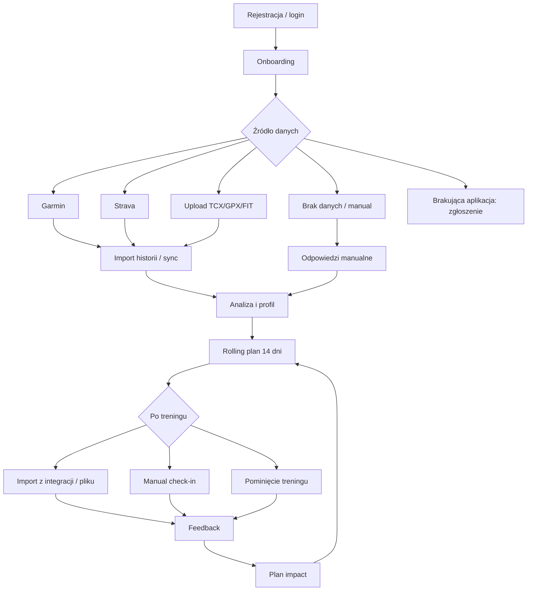
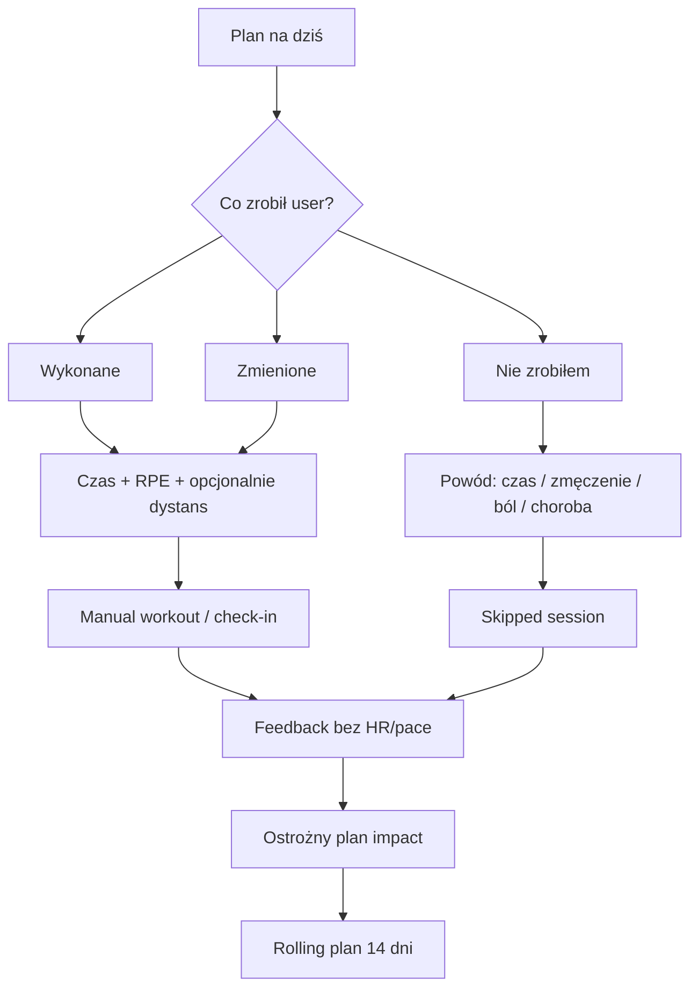

# MarcinCoach v2 — scenariusze użytkownika do konsultacji IT

Stan dokumentu: 2026-04-30.
Cel: jeden czytelny plik dla konsultacji z działem IT. Dokument scala mapę scenariuszy z `docs/user-scenarios/` i pokazuje, które ścieżki użytkownika są już obsłużone, które są częściowe, a które wymagają decyzji technicznej lub wdrożenia.

Źródła szczegółowe:
- `01-onboarding-data-sources.md` do `08-manual-check-in.md`
- `coverage-matrix.md`
- `gaps-and-next-steps.md`

---

## 1. Kontekst produktu

MarcinCoach v2 jest aplikacją coachingową dla biegaczy. Docelowa pętla użytkownika:

1. User zakłada konto lub loguje się.
2. Nowy user po rejestracji trafia do first-run onboardingu.
3. User dostarcza dane: integracja, plik treningowy albo manualny opis.
4. System buduje profil i analizuje historię / odpowiedzi.
5. System generuje rolling plan 14 dni.
6. Po treningu system zbiera wykonanie, generuje feedback i aktualizuje kolejny plan.

Najważniejsza zasada produktowa: aplikacja nie może wymagać zegarka ani integracji. User bez Garmina, Stravy i plików TCX/FIT/GPX nadal musi mieć działającą pętlę przez manual check-in. Onboarding powinien startować od razu po założeniu konta, ale user po skipie/przerwaniu musi mieć później jasny powrót z Dashboardu lub Profilu.

---

## 2. Statusy i priorytety

Statusy:
- `implemented` — działa na produkcji albo jest pokryte testami.
- `partial` — działa fragment, np. backend jest gotowy, ale UI nie domyka flow.
- `missing` — brak funkcji.
- `unknown` — kod lub opis istnieje, ale brakuje smoke/testu end-to-end.

Priorytety:
- `P0` — blokuje MVP lub publiczny launch.
- `P1` — ważne po MVP, ale da się czasowo obejść.
- `P2` — przyszłość, edge case albo placeholder roadmapowy.

Skróty w tabelach:
- FE — frontend
- BE — backend
- Test — test automatyczny
- Smoke — smoke produkcyjny

---

## 3. Schemat głównej pętli

---

## 4. Schemat manual check-in

Ten flow jest krytyczny dla MVP, bo obsługuje użytkownika bez integracji i bez plików.

Stan po EP-007..EP-010: manual check-in ma osobny kontrakt `POST /api/workouts/manual-check-in`, tworzy syntetyczny workout dla `done/modified`, obsługuje `skipped` bez pliku i ma lokalny smoke API pełnej pętli.

---

## 5. Główne decyzje dla IT

1. **Manual check-in jako P0.** Endpoint `POST /api/workouts/manual-check-in` istnieje; do konsultacji zostaje produkcyjny/browser smoke i szczegóły plan impact dla skipped.
2. **Onboarding first-run + resumable.** Nowy user po rejestracji trafia do onboardingu, ale jeśli go pominie/przerwie, aplikacja pokazuje później CTA "Dokończ onboarding" z Dashboardu/Profilu.
3. **Feedback UX.** Frontend pokazuje deterministyczny feedback po treningu; do domknięcia zostaje manual smoke import/check-in → feedback.
4. **Rolling plan.** Aktualny kontrakt dla nowego planu to `GET /api/rolling-plan?days=14` i `POST /api/rolling-plan`.
5. **Profil.** Aktualny kontrakt profilu to `GET/PUT /api/me/profile`.
6. **Strava.** Backend ma elementy OAuth/sync, ale produkcja wymaga credentials i smoke z realnym kontem.
7. **Garmin.** History sync i wysyłka workoutu były smoke'owane 26.04; auto-sync i MFA UI są nadal lukami.
8. **RODO.** Nie blokuje zamkniętej bety, ale blokuje publiczny launch dla realnych nieanonimowych użytkowników w UE.
9. **Polar/Suunto/Coros.** To są ścieżki backlogowe, nie MVP blockers: Polar/Suunto jako przyszłe API, Coros tylko przez oficjalny partner/API access; dla Suunto mamy tymczasowy Sports Tracker test bridge do zamkniętych testów, a fallbackiem pozostaje FIT/TCX/GPX + "Powiadom nas".
10. **Smoke E2E.** Skrypt `scripts/e2e-cross-stack.mjs` jest missing/TODO; lokalnie istnieje tylko `scripts/import-tcx.ps1`.

---

## 6. Zakres MVP z perspektywy IT

MVP można uznać za domknięte, gdy:

1. Nowy user może sam założyć konto, zalogować się i odzyskać hasło.
2. User po rejestracji trafia do onboardingu i może go później dokończyć, jeśli go pominie/przerwie.
3. User widzi rolling plan 14 dni.
4. Po treningu user może:
   - zaimportować trening,
   - albo zapisać manual check-in,
   - albo oznaczyć trening jako pominięty.
5. User widzi feedback i wpływ na kolejny plan.
6. Smoke E2E przechodzi przez 7 kolejnych dni.
7. Brak P0 `missing` w macierzy pokrycia.

Publiczny launch wymaga dodatkowo zamknięcia RODO: zgody, regulamin/polityka prywatności, export danych, usunięcie konta, audit log zgód i disclaimer medyczny.

---

## 7. Podsumowanie liczbowe

Aktualna macierz zawiera 107 scenariuszy:

| Priorytet | Liczba |
|---|---:|
| P0 | 60 |
| P1 | 40 |
| P2 | 7 |

| Status | Liczba |
|---|---:|
| implemented | 35 |
| partial | 39 |
| missing | 24 |
| unknown | 9 |

P0 only:

| Status P0 | Liczba |
|---|---:|
| implemented | 25 |
| partial | 27 |
| missing | 5 |
| unknown | 3 |

---

## 8. Pełna mapa scenariuszy

### 8.1 Onboarding i wybór źródła danych

| ID | Scenariusz | Pri | Status | IT focus |
|---|---|---|---|---|
| US-ONBOARD-001 | Rejestracja nowego użytkownika | P0 | partial | Bazowy UI rejestracji jest; email do resetu dodany, nadal brak pełnego smoke |
| US-ONBOARD-002 | Login istniejącego użytkownika | P0 | implemented | Sesja `x-session-token` + `x-username` |
| US-ONBOARD-003 | Wizard faza 1 — wybór źródła | P0 | implemented | FE flow wyboru danych |
| US-ONBOARD-004 | Wizard faza 2 — pytania | P0 | partial | Mapping pól do profilu |
| US-ONBOARD-005 | Skip onboardingu | P0 | implemented | Dashboard bez danych |
| US-ONBOARD-006 | Powiadom o brakującej aplikacji | P1 | missing | Formularz requestu integracji/API |
| US-ONBOARD-007 | Powrót do onboardingu z Dashboardu/Profilu | P0 | partial | CTA i prefill są, brakuje e2e smoke i pełnego flow edycji |
| US-ONBOARD-008 | Onboarding na mobile | P1 | unknown | Mobile audit |
| US-ONBOARD-009 | Multi-session login | P1 | implemented | Równoległe sesje |
| US-ONBOARD-010 | Manual onboarding bez danych | P0 | partial | Core fallback do manual check-in |

### 8.2 Import plików i jakość danych

| ID | Scenariusz | Pri | Status | IT focus |
|---|---|---|---|---|
| US-IMPORT-001 | Multi-upload TCX w onboardingu | P0 | implemented | Batch upload TCX |
| US-IMPORT-002 | Upload GPX i FIT z UI | P1 | partial | Backend parser jest, UI missing/partial |
| US-IMPORT-003 | Single upload w dashboardzie | P0 | implemented | TCX dashboard upload |
| US-IMPORT-004 | Upload duplikatu | P0 | implemented | `dedupe_key` |
| US-IMPORT-005 | Upload pliku z innego sportu | P0 | partial | Cross-training zamiast reject |
| US-IMPORT-006 | Korekta klasyfikacji aktywności | P1 | missing | UI + endpoint aktualizacji sportu |
| US-IMPORT-007 | Upload z malformed XML | P0 | implemented | Parser validation |
| US-IMPORT-008 | Sanity check: zbyt wysokie tempo | P1 | missing | Data quality rules |
| US-IMPORT-009 | Plik bez dystansu | P1 | unknown | Parser edge case |
| US-IMPORT-010 | Plik bez HR | P0 | implemented | Low-data feedback |
| US-IMPORT-011 | Trening z dzisiaj vs historyczny | P1 | missing | Pipeline distinction |
| US-IMPORT-012 | Upload bardzo dużego pliku | P1 | unknown | Limits/timeouts |
| US-IMPORT-013 | Upload przerwany przez timeout | P1 | unknown | Retry/partial save |
| US-IMPORT-014 | Multi-upload mieszany | P0 | partial | Partial success handling |
| US-IMPORT-015 | Upload ZIP | P2 | missing | Future bulk import |
| US-IMPORT-016 | Obsługa błędów technicznych | P1 | partial | Error model |

### 8.3 Analiza i profil

| ID | Scenariusz | Pri | Status | IT focus |
|---|---|---|---|---|
| US-ANALYSIS-001 | Analiza po imporcie >=6 treningów | P0 | partial | Analytics + UI completeness |
| US-ANALYSIS-002 | Niski confidence przy <6 treningach | P0 | partial | Low-data guard |
| US-ANALYSIS-003 | Brak danych po skipie | P0 | partial | Empty state + plan startowy |
| US-ANALYSIS-004 | Propozycja stref HR | P1 | missing | Endpoint/UI propozycji stref |
| US-ANALYSIS-005 | Propozycja stref pace | P1 | missing | Pace zones |
| US-ANALYSIS-006 | Wyświetlenie historii treningów | P0 | implemented | Workout list |
| US-ANALYSIS-007 | Trend formy / progres | P1 | missing | Trend UI |
| US-ANALYSIS-008 | Profile Quality Score widoczny | P1 | implemented | Widget w Profilu pokazuje score, pasek i braki po EP-013 |

### 8.4 Plan i feedback

| ID | Scenariusz | Pri | Status | IT focus |
|---|---|---|---|---|
| US-PLAN-001 | Pierwszy rolling plan 14 dni | P0 | implemented | `GET /api/rolling-plan?days=14` |
| US-PLAN-002 | Plan na dzień dzisiejszy widoczny | P0 | partial | Today highlight |
| US-PLAN-003 | Refresh planu manualny | P0 | implemented | `POST /api/rolling-plan` |
| US-PLAN-004 | Auto-refresh planu po imporcie/check-inie | P1 | implemented | Frontend refreshes `GET /api/rolling-plan?days=14` after import/check-in |
| US-PLAN-005 | Generowanie feedbacku po treningu | P0 | implemented | Backend i frontend feedbacku są; zostaje smoke E2E |
| US-PLAN-006 | Trening zgodny z planem | P0 | partial | Compliance feedback |
| US-PLAN-007 | Trening krótszy niż planowany | P0 | partial | Deviation feedback |
| US-PLAN-008 | Trening dłuższy/mocniejszy | P0 | partial | Load/fatigue guard |
| US-PLAN-009 | Trening spontaniczny | P0 | partial | Unplanned workout |
| US-PLAN-010 | Pominięty kluczowy trening | P0 | partial | Missed key workout UX |
| US-PLAN-011 | Cross-training planowany | P1 | partial | Planned cross-training |
| US-PLAN-012 | Cross-training spontaniczny | P1 | partial | Activity impact |
| US-PLAN-013 | Race profile w planie | P1 | partial | Race influence |
| US-PLAN-014 | Zmiana celu w trakcie cyklu | P1 | partial | Replan after profile change |
| US-PLAN-015 | Powrót po przerwie / chorobie | P0 | partial | Safe return UX |
| US-PLAN-016 | Zgłoszenie bólu w trakcie cyklu | P0 | partial | Medical disclaimer + plan guard |
| US-PLAN-017 | Brak treningu kilka dni | P1 | partial | Drift detection |
| US-PLAN-018 | Pełna pętla po pierwszym treningu | P0 | partial | Local API smoke EP-010; prod/browser smoke missing |

### 8.5 Integracje

| ID | Scenariusz | Pri | Status | IT focus |
|---|---|---|---|---|
| US-GARMIN-001 | Połączenie konta Garmin | P0 | implemented | Smoke 26.04 |
| US-GARMIN-002 | Konto z MFA | P1 | partial | Brak MFA UI |
| US-GARMIN-003 | Sync historii 30 dni | P0 | implemented | Smoke 26.04 |
| US-GARMIN-004 | Auto-sync nowych aktywności | P1 | missing | Cron/polling/webhook strategy |
| US-GARMIN-005 | Wysyłka workoutu do Garmin | P1 | implemented | Smoke 26.04 |
| US-GARMIN-006 | Błąd connectora offline | P0 | partial | Error handling |
| US-GARMIN-007 | Odłączenie konta Garmin | P1 | implemented | Lokalny disconnect konta integracji; provider revoke osobno w RODO |
| US-STRAVA-001 | Połączenie konta Strava OAuth | P0 | unknown | Prod credentials + smoke |
| US-STRAVA-002 | Sync historii Strava | P0 | unknown | Prod smoke |
| US-STRAVA-003 | Webhook dla nowych aktywności | P1 | missing | Webhook subscription |
| US-STRAVA-004 | Brak zgody na zakres / scope | P1 | unknown | OAuth denial path |
| US-STRAVA-005 | Refresh access_token | P0 | partial | Token refresh |
| US-POLAR-001 | Placeholder Polar w onboardingu | P2 | missing | Future placeholder |
| US-POLAR-002 | Pełna integracja Polar | P2 | missing | Future API |
| US-SUUNTO-001 | Placeholder Suunto w onboardingu | P2 | missing | Future placeholder |
| US-SUUNTO-002 | Tymczasowy Suunto Sports Tracker test bridge | P1 | partial | Backend endpoint, feature flag, bez trwalego zapisu tokena; UI/prod smoke missing |
| US-COROS-001 | Coros bez integracji, fallback FIT/TCX | P2 | missing | File fallback |
| US-COROS-002 | Pełna integracja Coros | P2 | missing | Future partnership/API |
| US-RACE-001 | Ręczne dodanie startu | P0 | implemented | `RacesManager` + `PUT /api/me/profile` races |
| US-RACE-002 | Edycja startu / zmiana celu | P1 | implemented | Edycja inline w Profilu |
| US-RACE-003 | Usunięcie startu | P1 | implemented | Usunięcie z listy w Profilu |
| US-GARMIN-EVENT-001 | Import eventu z Garmin Event Dashboard | P2 | missing | Spike |
| US-INTEGRATION-001 | Globalny widok integracji | P1 | implemented | Ustawienia pokazują status, last sync, sync/connect/disconnect po EP-014 |

### 8.6 Auth, sesja i smoke

| ID | Scenariusz | Pri | Status | IT focus |
|---|---|---|---|---|
| US-AUTH-001 | Login z poprawnymi danymi | P0 | implemented | Auth happy path |
| US-AUTH-002 | Login z niepoprawnymi danymi | P0 | implemented | 401 handling |
| US-AUTH-003 | Logout | P0 | implemented | Token revoke |
| US-AUTH-004 | Sesja wygasa po 30 dniach | P0 | implemented | Cache TTL |
| US-AUTH-005 | Ręczne usunięcie tokena | P1 | partial | Local storage edge case |
| US-AUTH-006 | 401 podczas autoload | P1 | partial | Global interceptor po EP-004; smoke/cancel inflight brak |
| US-AUTH-007 | Sesja wygasła w trakcie uploadu | P1 | partial | Retry/session expired UX |
| US-AUTH-008 | Login na 2 urządzeniach | P1 | implemented | Multi-session |
| US-AUTH-009 | Zapomniałem hasła / reset | P0 | partial | API/mail/UI po EP-005; brak SMTP smoke i revoke starych sesji |
| US-AUTH-010 | Zmiana hasła z profilu | P1 | missing | Profile settings |
| US-AUTH-011 | Smoke: register/login/profile | P0 | partial | Local API smoke EP-010; prod cron missing |
| US-AUTH-012 | Smoke: pełny flow MVP | P0 | partial | Local API smoke EP-010; prod/browser smoke missing |
| US-AUTH-013 | Frontend deploy nie psuje produkcji | P0 | partial | Deploy smoke |
| US-AUTH-014 | CORS / cross-origin | P0 | implemented | Production API access |
| US-AUTH-015 | Backend healthcheck | P0 | implemented | `/api/health` |

### 8.7 Prywatność i RODO

| ID | Scenariusz | Pri | Status | IT focus |
|---|---|---|---|---|
| US-PRIVACY-001 | Zgody przy rejestracji | P0 | missing | Consent storage |
| US-PRIVACY-002 | Odłączenie integracji revoke | P0 | partial | UI i lokalny disconnect są; provider-side revoke nadal do zaprojektowania |
| US-PRIVACY-003 | Export danych | P0 | missing | Data portability |
| US-PRIVACY-004 | Usunięcie konta i danych | P0 | missing | Cascade delete |
| US-PRIVACY-005 | Granica info treningowa/medyczna | P0 | missing | Medical disclaimer |
| US-PRIVACY-006 | Dane zdrowotne jako wrażliwe | P0 | unknown | Data classification |
| US-PRIVACY-007 | Audit log zgód | P0 | missing | Consent audit |
| US-PRIVACY-008 | Sprostowanie / edycja danych | P1 | partial | Edit profile/data |
| US-PRIVACY-009 | Cookies i tracking | P1 | unknown | Only if analytics |
| US-PRIVACY-010 | Komunikacja po breachu | P1 | missing | Incident response |

### 8.8 Manual check-in

| ID | Scenariusz | Pri | Status | IT focus |
|---|---|---|---|---|
| US-MANUAL-001 | Plan startowy bez integracji i bez plików | P0 | partial | Low-data rolling plan; local API smoke EP-010 |
| US-MANUAL-002 | Oznaczenie dzisiejszego treningu jako wykonanego | P0 | implemented | API/UI done; local API smoke EP-010 |
| US-MANUAL-003 | Check-in z częściowymi danymi | P0 | implemented | Optional duration/distance/RPE/pain |
| US-MANUAL-004 | Trening wykonany inaczej niż plan | P0 | implemented | `modified` compliance |
| US-MANUAL-005 | Pominięcie zaplanowanego treningu | P0 | partial | Skipped state exists; plan-impact/browser smoke still needed |
| US-MANUAL-006 | Feedback bez telemetryki | P0 | implemented | No fake HR/pace; local API smoke EP-010 |
| US-MANUAL-007 | Długoterminowy manual mode | P1 | missing | 14+ days without files/integrations |

---

## 9. Najważniejsze luki P0 do omówienia

### Missing

| ID | Luka | Decyzja IT |
|---|---|---|
| US-PRIVACY-001 | Zgody przy rejestracji | Tabela/audit zgód, wersje dokumentów |
| US-PRIVACY-003 | Export danych | Format exportu, async job, raw files |
| US-PRIVACY-004 | Usunięcie konta i danych | Cascade delete/anonymizacja |
| US-PRIVACY-005 | Granica medyczna | Stałe disclaimery i copy UI |
| US-PRIVACY-007 | Audit log zgód | Immutable audit |

### Unknown

| ID | Luka | Decyzja IT |
|---|---|---|
| US-STRAVA-001/002 | Strava prod OAuth/sync | Credentials + smoke account |
| US-PRIVACY-006 | Dane zdrowotne | Klasyfikacja, retencja, dostęp |

---

## 10. Proponowana kolejność prac dla IT

1. Monitoring i smoke: healthcheck, login smoke, produkcyjny/browser E2E smoke script.
2. Auth: rejestracja UI, reset hasła, globalny 401/session expired UX.
3. Pętla treningowa MVP: lokalny API smoke jest po EP-010; do domknięcia produkcyjny/browser smoke po feedbacku, auto-refreshu planu i manual check-inie.
4. Profil i nawigacja: Profil, Starty i integracje są po EP-011..EP-014; zostaje browser smoke oraz powrót do onboardingu.
5. RODO przed publicznym launchem: zgody, export, delete, disclaimer, audit.
6. Integracje: Strava prod smoke, Strava webhook, Garmin auto-sync/MFA, widok integracji.
7. Import/data quality: GPX/FIT UI, korekta klasyfikacji, sanity checks.

---

## 11. Kontrakty API do szczególnej weryfikacji

Aktualne:
- `GET /api/me`
- `GET /api/me/profile`
- `PUT /api/me/profile`
- `GET /api/workouts`
- `POST /api/workouts/upload`
- `GET /api/rolling-plan?days=14`
- `POST /api/rolling-plan`
- `POST /api/workouts/{id}/feedback/generate`
- `GET /api/workouts/{id}/feedback`
- `POST /api/workouts/manual-check-in`
- `GET /api/integrations/status`
- `DELETE /api/integrations/{provider}`
- `POST /api/integrations/strava/connect`
- `GET /api/integrations/strava/callback`
- `POST /api/integrations/strava/sync`
- `POST /api/integrations/garmin/connect`
- `POST /api/integrations/garmin/sync`
- `POST /api/integrations/garmin/workouts/send`
- `POST /api/integrations/suunto/sports-tracker/sync`

Do zaprojektowania:
- Provider-side revoke po lokalnym disconnect integracji.
- Pełny plan impact dla skipped session w produkcyjnym/browser smoke.
- Reset hasła: SMTP smoke i decyzja o revoke starych sesji po resecie.
- Export i delete konta.
- Consent audit.

---

## 12. Pytania dla konsultacji IT

1. Jaki model danych przyjmujemy dla manual check-in: osobny typ workoutu, osobna tabela `planned_session_checkins`, czy rozszerzenie istniejącego `workouts`?
2. Czy pominięcie treningu ma tworzyć rekord workoutu, czy osobny rekord compliance/check-in?
3. Jak idempotentnie powiązać check-in z planowaną sesją z danego dnia?
4. Czy plan regeneruje się automatycznie po każdym check-inie, czy frontend wywołuje `POST /api/rolling-plan`?
5. Czy Strava na produkcji ma już finalne credentials i redirect URI?
6. Jakie minimum RODO jest wymagane przed zamkniętą betą, a jakie przed publicznym launchem?
7. Gdzie uruchamiamy smoke E2E: GitHub Actions, cron na serwerze, czy zewnętrzny monitoring?
